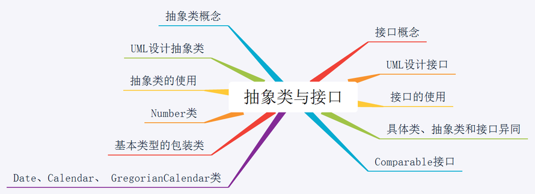

# Java入门

## Java的概述

Java是一种面向对象的程序设计语言，最大的优势是借助虚拟机机制实现跨平台特性。
“write one , run everywhere”

Java分为三个体系：（Java SE、Java EE、Java ME）
Java SE（Java Standard Edition，标准版）	用于针对普通PC的标准应用程序开发
Java EE（Java Enterprise Edition，企业版）用于针对企业级进行应用服务的开发
Java ME（Java Micro Edition，微型版）	常用于嵌入式设备及消费类电器上的开发

1995年5月23日，JDK(Java Development Kits)1.0版本正式对外公布，标志着Java语言诞生

## Java的特点

1．平台独立性

2．安全性

3．多线程

4．网路化

5．面向对象（封闭性、继承性、多态性）

## Java应用程序Java application与Java小应用程序Java applet

1.  小应用程序只能在与Java兼容的容器中运行，可以嵌入在HTML网页内，在网络上发布，当网页被浏览时，在浏览器中运行。小应用程序的运行还受到严格的安全限制，例如它不能访问用户计算机上的文件。Java应用程序没有这些限制，也不支持网页嵌入和下载运行。

2.  小应用程序和应用程序在代码编写上也有很大的差异。一个小应用程序必须定义成一个Applet类的子类，应用程序可以是Applet类的子类，也可以不是。应用程序必须在一个类中定义一个main()方法，该方法代表应用程序的入口。而小应用程序不必定义main（）方法，它的执行由Applet类中定义的多个方法控制。

## java运行过程

## 思维导图

